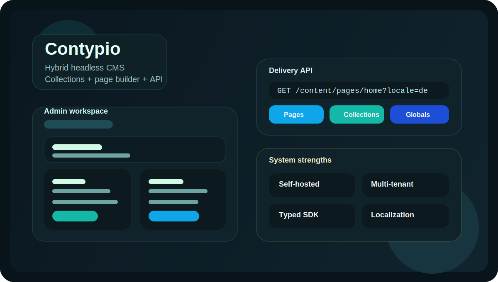
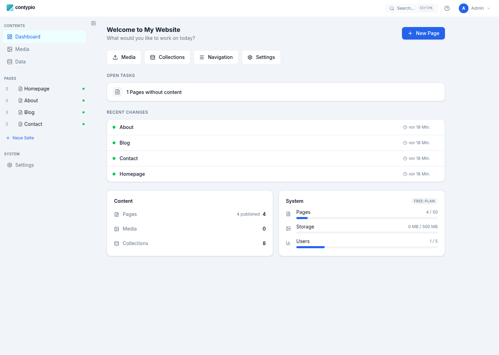
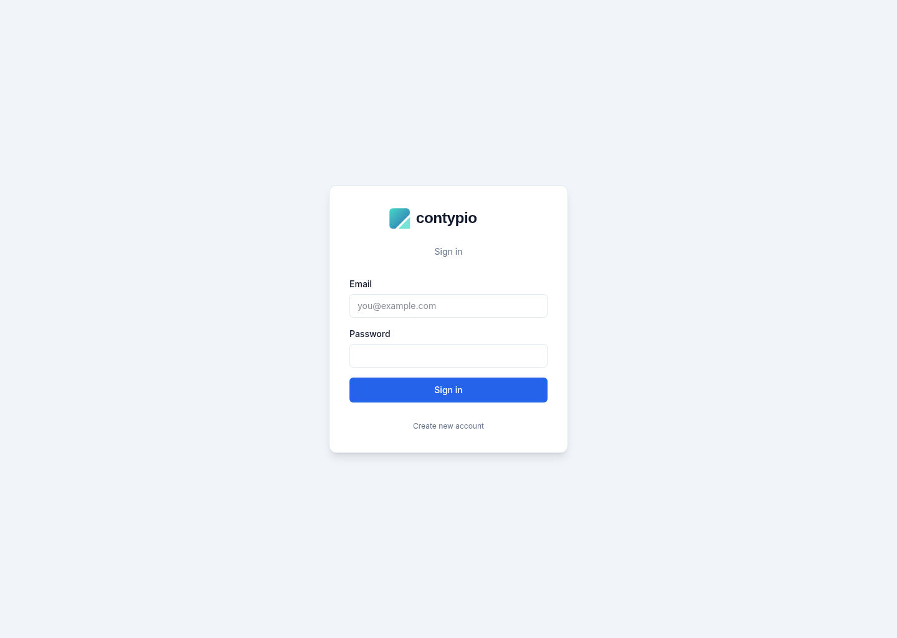
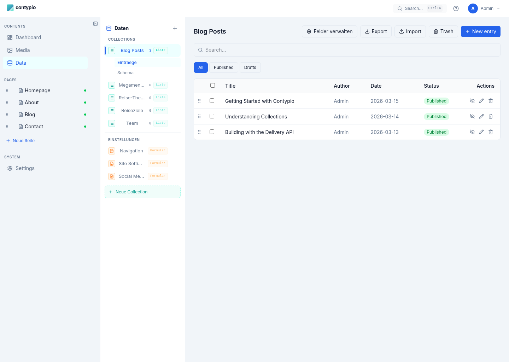
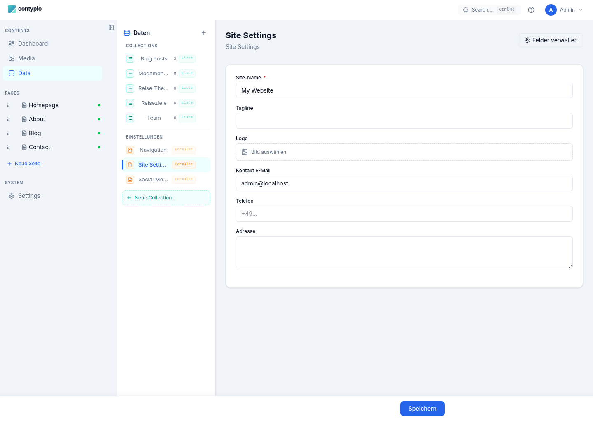
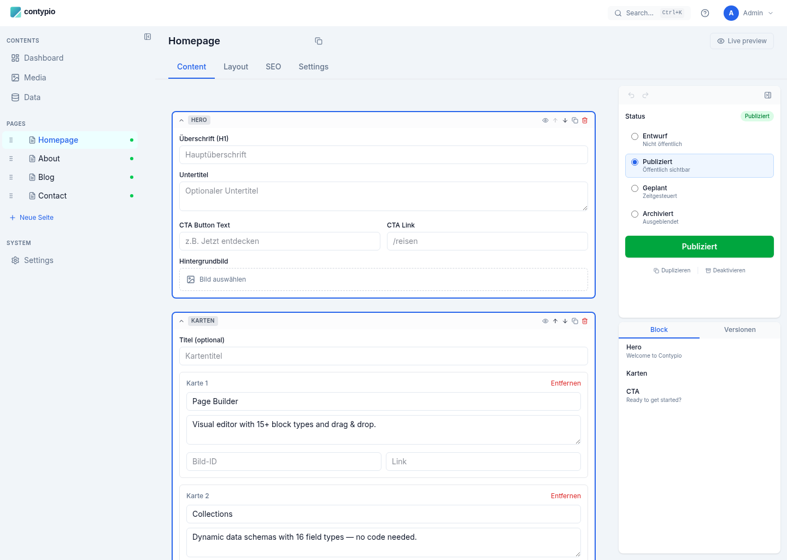
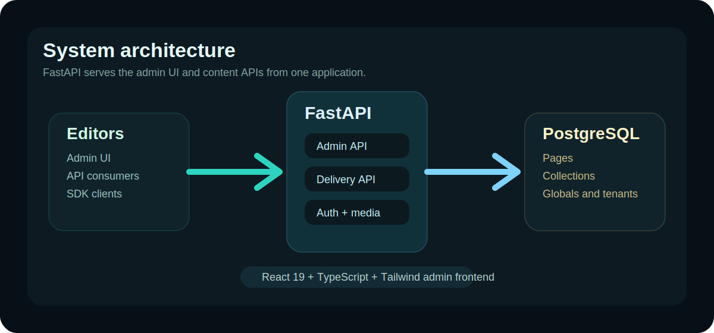
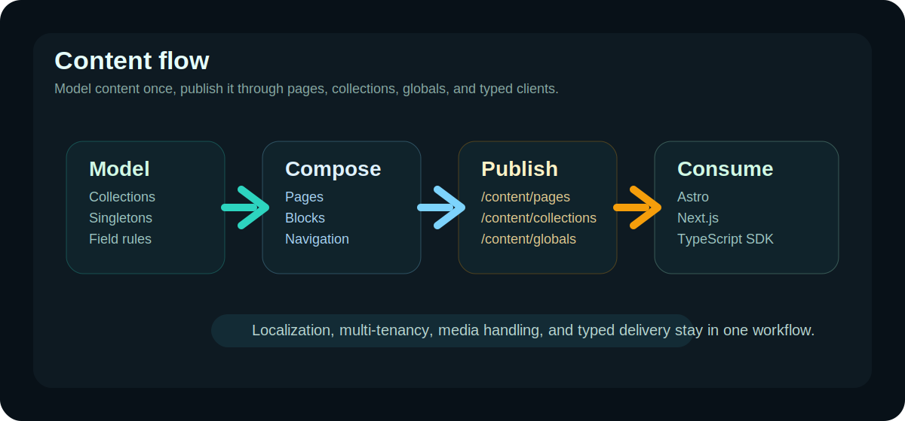

# Contypio

<p align="center">
  
</p>

<p align="center">
  Hybrid headless CMS for structured content, visual pages, and self-hosted delivery.
</p>

<p align="center">
  
</p>

<p align="center">
  
</p>

## English

Contypio combines a schema-driven CMS, page builder, delivery API, and typed client SDK in one stack. It is aimed at teams that want more structure than WordPress, but less platform overhead than a large enterprise CMS.

### Why it is useful

- Model content with collections and singleton globals.
- Build landing pages and editorial pages with reusable blocks.
- Deliver content through `/content/*` endpoints for websites and apps.
- Run it self-hosted with Docker, PostgreSQL, FastAPI, React, and TypeScript.

### Product screenshots

<p align="center">
  
  
</p>

<p align="center">
  
  
</p>

### System graphics

<p align="center">
  
</p>

<p align="center">
  
</p>

### Advantages

| Area | Strength |
|---|---|
| Product model | Combines structured collections and visual page composition in one product |
| Hosting | Self-hosted, Docker-first, no separate nginx layer required for local setup |
| API | Public delivery API for pages, collections, globals, locales, and batch access |
| Frontend usage | TypeScript SDK package under `packages/contypio-client` |
| Operations | Multi-tenant foundation, localization, media handling, and admin UI in one repo |

### Trade-offs

| Area | Limitation |
|---|---|
| Ecosystem | Smaller ecosystem than WordPress, Strapi, or Directus |
| Astro launch | Astro starter and public reference integration are still planned work |
| Maturity | Some roadmap items are documented but not yet fully productized |
| Positioning | Hybrid model is powerful, but needs stronger starter templates and examples for onboarding |

### Quick start

```bash
cp .env.example .env
docker compose up -d
```

Open `http://localhost:3000`.

### Local development

```bash
docker compose -f docker-compose.yml -f docker-compose.dev.yml up
```

Important paths:

- `backend/` FastAPI app, delivery API, auth, services, migrations
- `frontend/` React admin UI built with Vite and TypeScript
- `packages/contypio-client/` TypeScript SDK
- `docs/astro-go-live/` launch planning, support matrix, issue backlog

### Tech stack

| Layer | Stack |
|---|---|
| Backend | FastAPI, SQLAlchemy, Alembic, PostgreSQL |
| Frontend | React 19, TypeScript 5.9, Vite 8, Tailwind 4 |
| SDK | TypeScript package with typed client access |
| Infra | Docker Compose, optional reverse proxy for production |

### Best fit

- Agencies running multiple customer websites
- Teams wanting a self-hosted CMS with structured content and landing pages
- Projects that need public content APIs and a typed frontend integration path

### Less ideal if

- You need a huge plugin marketplace today
- You want a fully managed SaaS CMS with zero ops
- You depend on an already finished Astro starter right now

---

## Deutsch

Contypio verbindet schema-getriebenes Content Modeling, Page Builder, Delivery API und ein typisiertes Client-SDK in einem Stack. Das System ist fuer Teams gedacht, die mehr Struktur als bei WordPress wollen, aber weniger Plattformaufwand als bei einem grossen Enterprise-CMS.

### Warum das System interessant ist

- Inhalte ueber Collections und Singleton-Globals modellieren.
- Landingpages und redaktionelle Seiten mit wiederverwendbaren Blocks bauen.
- Inhalte ueber `/content/*` an Websites und Apps ausliefern.
- Self-hosted mit Docker, PostgreSQL, FastAPI, React und TypeScript betreiben.

### Produkt-Screenshots

<p align="center">
  
  
</p>

<p align="center">
  
  
</p>

### Vorteile

| Bereich | Vorteil |
|---|---|
| Produktansatz | Strukturierte Daten und visuelle Seitenerstellung in einem System |
| Betrieb | Self-hosted, Docker-first, lokal ohne zusaetzliche nginx-Schicht startbar |
| API | Oeffentliche Delivery API fuer Seiten, Collections, Globals, Locales und Batch-Endpunkte |
| Frontend-Anbindung | TypeScript-SDK unter `packages/contypio-client` |
| Plattform | Multi-Tenancy, Lokalisierung, Media-Handling und Admin-Oberflaeche in einem Repo |

### Nachteile

| Bereich | Nachteil |
|---|---|
| Oekosystem | Kleineres Oekosystem als WordPress, Strapi oder Directus |
| Astro-Positionierung | Astro-Starter und oeffentliche Referenzintegration sind noch offene Arbeitspakete |
| Reifegrad | Teile der Roadmap sind dokumentiert, aber noch nicht komplett produktisiert |
| Einstieg | Fuer schnelles Onboarding fehlen noch mehr Starter, Demo-Flows und Referenzprojekte |

### Schnellstart

```bash
cp .env.example .env
docker compose up -d
```

Danach ist das System unter `http://localhost:3000` erreichbar.

### Entwicklung

```bash
docker compose -f docker-compose.yml -f docker-compose.dev.yml up
```

Wichtige Pfade:

- `backend/` FastAPI-App, Delivery API, Auth, Services, Migrationen
- `frontend/` React-Admin mit Vite und TypeScript
- `packages/contypio-client/` TypeScript-SDK
- `docs/astro-go-live/` Astro-Go-Live-Planung, Support-Matrix und Issue-Backlog

### Geeignet fuer

- Agenturen mit mehreren Kundenprojekten
- Teams, die strukturierte Inhalte und visuelle Seiten in einem CMS brauchen
- Projekte mit API-first-Auslieferung und typisiertem Frontend-Consumption-Path

### Weniger geeignet, wenn

- sofort ein grosses Plugin-Oekosystem benoetigt wird
- ein komplett gemanagtes SaaS-CMS ohne Betriebsaufwand gesucht wird
- heute schon ein fertig produktisierter Astro-Starter zwingend noetig ist
